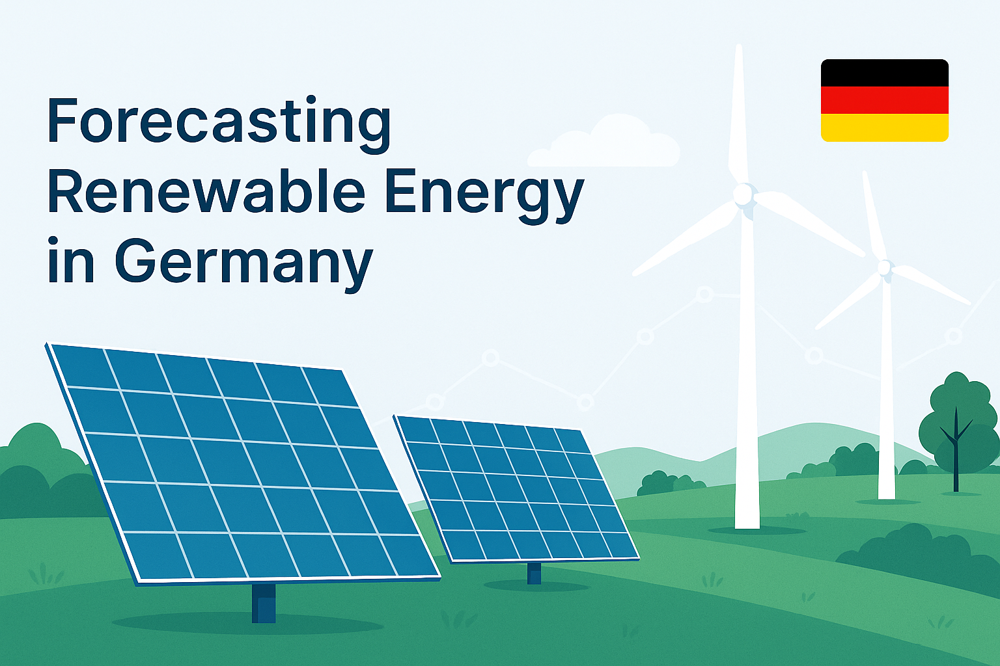
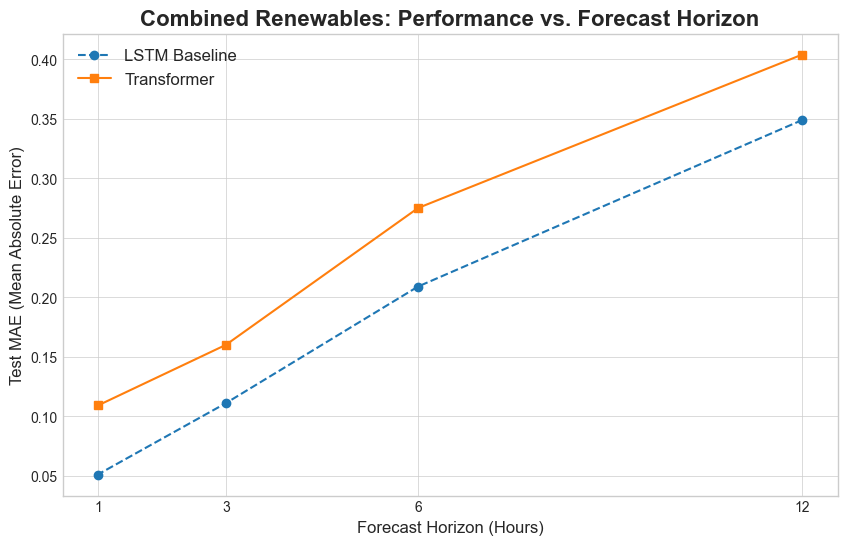
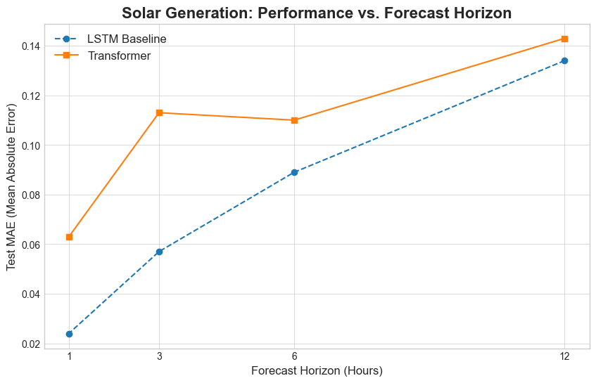
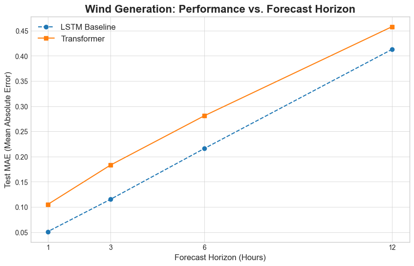
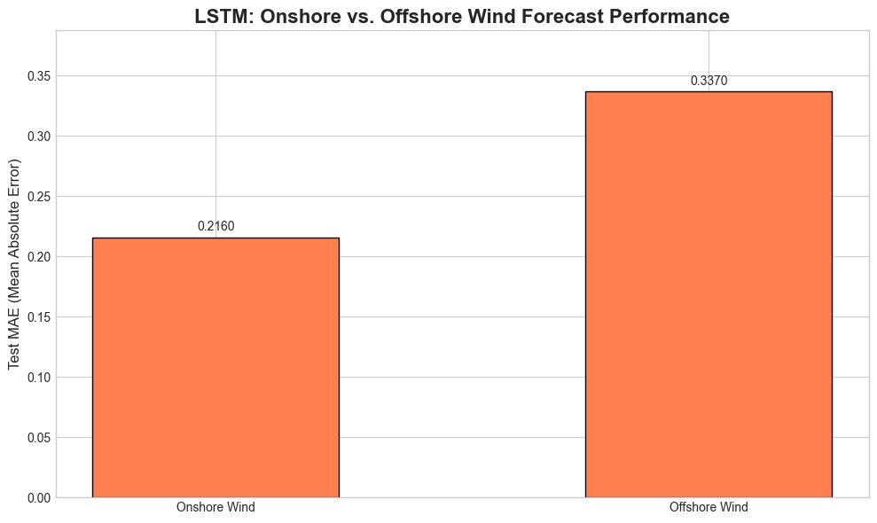
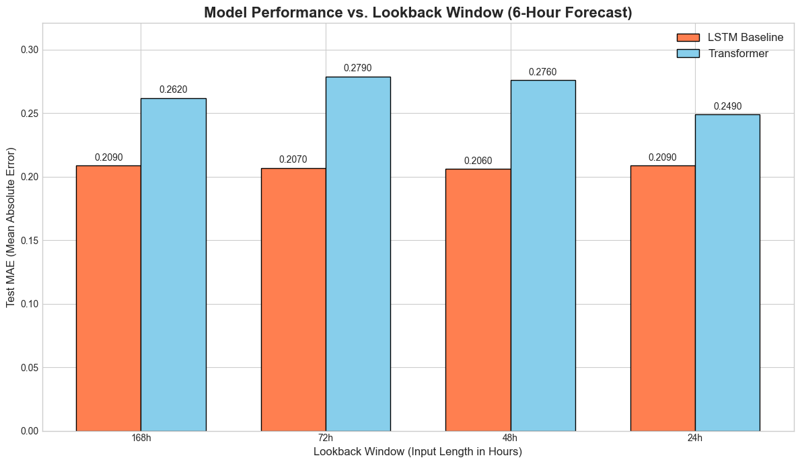
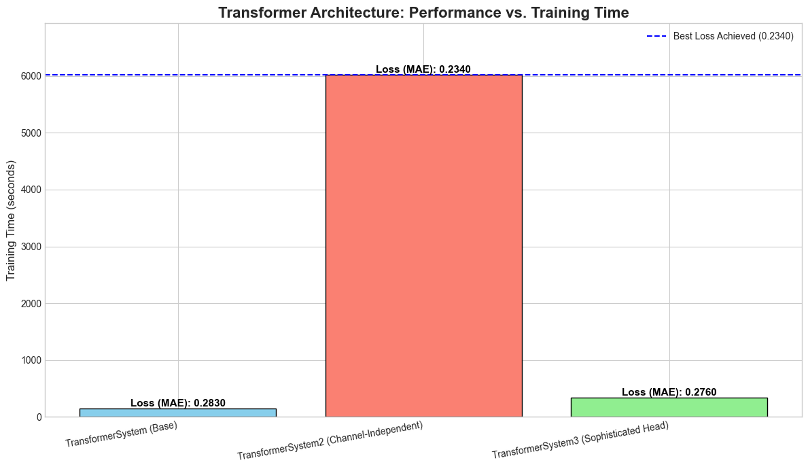

[](https://www.python.org/)[](https://pytorch.org/)[](LICENSE)

# ⚡ End-to-End Deep Learning for Renewable Energy Forecasting in Germany 🇩🇪

## 📖 Table of Contents

- [1. 🌍 Project Overview](#1-project-overview)
- [2. 📊 Key Findings & Results](#2-key-findings--results)
- [3. 📈 Visualizations](#3-visualizations)
- [4. 🧠 Methodology and Workflow](#4-methodology-and-workflow)
- [5. 🛠️ Technologies Used](#5-technologies-used)
- [6. 🗂️ Project Structure](#6-project-structure)
- [7. 🚀 How to Run This Project](#7-how-to-run-this-project)
- [8. 📣 Acknowledgments](#9-acknowledgments)
---

## 1. 🌍 Project Overview

This project presents an end-to-end deep learning solution for forecasting hourly renewable energy generation in Germany. As Germany's *Energiewende* (energy transition) progresses, the grid's reliance on volatile sources like wind 🌬️ and solar ☀️ increases, making accurate forecasting essential for grid stability and energy market operations.

This repository documents the entire workflow, from sourcing and processing raw multi-modal data to building, systematically tuning, and comparing custom deep learning models for various forecasting tasks.

### 📦 Datasets Used

- 📡 **Energy Data:** Hourly electricity generation, load, and capacity data from the [Open Power System Data (OPSD)](https://open-power-system-data.org/) platform.
- 🌤️ **Weather Data:** Historical hourly weather data for Germany sourced from the [Copernicus ERA5 Reanalysis Dataset](https://cds.climate.copernicus.eu/).

### 🏗️ Modeles

1. **📘 The LSTM Baseline (`LSTMBaselineSystem`)**

🧠 *Think of the LSTM as a diligent, sequential reader.*

- **🔍 How it works:**  
  It reads your time series data one hour at a time, in order. At each hour, it updates its "memory" (the hidden state) to keep track of important patterns it has seen so far. To predict the next hour, its decision is heavily influenced by the memory from the immediately preceding hours.

- **✅ Its Strength:**  
  This makes it extremely good at capturing short-term momentum and autocorrelation. It excels at answering the question, *"Given what just happened, what is most likely to happen next?"*

- **⚠️ Its Weakness:**  
  Over very long sequences, its memory can sometimes fade , making it harder to connect patterns from many days ago to the current moment.

1. **🔭 The Base Transformer (`TransformerSystem`)**

🧠 *Think of the Transformer as a strategic analyst with a panoramic view.*

- **🔍 How it works:**  
  Instead of reading step-by-step, it looks at the entire lookback window (e.g., a full week ) all at once. Its superpower is the self-attention mechanism , which allows it to weigh the importance of every hour relative to every other hour.  
  For example, it can learn that for predicting a sunny afternoon, the weather from 24 hours ago might be more important than the weather from 18 hours ago.

- **✅ Its Strength:**  
  It's brilliant at finding long-range dependencies and complex, non-obvious relationships across the entire dataset.

- **⚠️ Its Weakness:**  
  For very short-term forecasts, this powerful attention mechanism can sometimes be *overkill* — getting distracted by the big picture when the most important signal was simply what happened in the last hour.

1. **👥 The Channel-Independent Transformer (`TransformerSystem2`)**

🧠 *Think of this as an over-specialized team of analysts.*

- **🔍 How it works:**  
  This was an advanced version of the base Transformer. Instead of looking at all features at once, it assigned a **specialist** to each one.  
  One part of the model only looked at **solar**, another at **wind**, another at **load**, and so on. Then, at the end, they all got together to make a decision.

1. **📐 The Sophisticated Head Transformer (`TransformerSystem3`)**

🧠 *Think of this as an analyst with a different reporting style.*

- **🔍 How it works:**  
  This model used the same input as the successful base Transformer. The only difference was in the **final step**.  
  Instead of taking all the information from the encoder and flattening it into one big pile , it tried a more structured, **two-stage process** to "read out" the results.

- **❌ Why it didn't improve:**  
  The results showed this didn't help.  
  This is a classic finding in machine learning: sometimes the **simplest** and most **direct** method (like the base model’s flattening approach) is the most effective ✅ — and adding extra complexity doesn't provide any benefit .

### 👩🏻‍🔬 Experiments

for most experiments i used the baseline of below:

- 168 hours (1 week) lookback window
- 6 hours forecast
- and the combined energy forecast

---

## 2. 📊 Key Findings & Results

The primary goal was to develop a model that could accurately forecast renewable energy generation. The project yielded several key insights through rigorous experimentation:

1. 🔁 **LSTM Dominates ALL Forecasts:** LSTM consistently outperformed Transformer models.
2. ⚖️ **The optimal lookbackwindow for LSTM and the Transformer for 6-hour forecasts:** the optimal lookbackwindow for LSTM is 48 hours and for the Transformer is 24 hours
3. 🌊 **Offshore Wind is the Most Difficult to Predict:** Higher MAE due to data scarcity and complex weather patterns over the sea.
4. 🕒 **Transformer vs Transformer2 vs Transformer3:** even though Transformer2 outperforms the other 2 models it takes significantly longer to train (about 42 times longer) so we used the base transformer because of it's speed and acceptable performance.

---

## 3. 📈 Visualizations

### 📉 Performance vs. Forecast Horizon

Test MAE for LSTM and Transformer models across different forecast horizons:

| 🌐 Combined Renewables | ☀️ Solar Generation | 🌬️ Wind Generation |
| :---: | :---: | :---: |
|  |  |  |

### 🔬 Performance Analysis

| 🏞️ Onshore vs. Offshore Wind | 🔁 Lookback Comparison | 🧠 Transformer Architectures |
| :---: | :---: | :---: |
|  |  |  |

---

## 4. 🧠 Methodology and Workflow

### 📥 4.1. Data Sourcing and Engineering

- 🌐 **API Data Retrieval** using `cdsapi` and OPSD.
- 💾 **Efficient Data Pipeline** with retries and memory-safe chunking.
- 🧹 **Data Cleaning & Merging** using timestamp joins and interpolation.

### 🧮 4.2. Preprocessing and Feature Engineering

- 🔁 **Lag & Rolling Features**
- 🕰️ **Cyclical Time Features**
- 🧯 **Leakage Prevention**

### 🏗️ 4.3. Modeling

- ⚡ **LSTM Baseline:** 2-layer benchmark model.
- 🔀 **Transformer Variants:**
  1. `TransformerSystem` (Base)
  2. `TransformerSystem2` (Chanel-Independent)
  3. `TransformerSystem3` (Sophisticated Head)

### 🎯 4.4. Hyperparameter Optimization

- 🧪 **Optuna for Smart Tuning**
- ✂️ **Early Pruning for Speed**

### 🧪 4.5. Experiment

---

## 5. 🛠️ Technologies Used

- 💻 **Programming:** Python
- 📚 **Libraries:** Pandas, NumPy, Xarray, Scikit-learn
- 🤖 **Deep Learning:** PyTorch + Lightning
- 🎯 **Tuning:** Optuna
- ☁️ **Data Access:** `cdsapi`

---

## 6. 🗂️ Project Structure

``` bash
renewable-energy-forecast/
├── assets/
├── data/
│ └── Open_Power_System_Data/
├── scripts/
│ ├── preprocess.py
│ ├── models.py
│ ├── objective_optuna.py
│ └── main.py
├── notebooks/
├── checkpoints/
├── lightning_logs/
├── results/
├── requirements.txt
└── README.md
```

---

## 7. 🚀 How to Run This Project

### 📋 7.1. Prerequisites

- Python 3.10+
- Conda (recommended)
- CDS API key 📌

### 🧪 7.2. Running the Code

- 🧼 `preprocess.py`: Downloads and cleans data

- 🧠 `models.py`: Contains model classes

- 🔍 `objective_optuna.py`: Defines tuning objectives

- 🚀 `main.py:` Launches the experiments

## 8. 📣 Acknowledgments

This project would not have been possible without the high-quality, open-access data provided by the following organizations:

- **Open Power System Data (OPSD)** for the comprehensive German electricity grid data.
- **Copernicus Climate Change Service (C3S)** for providing the ERA5 reanalysis weather data.
